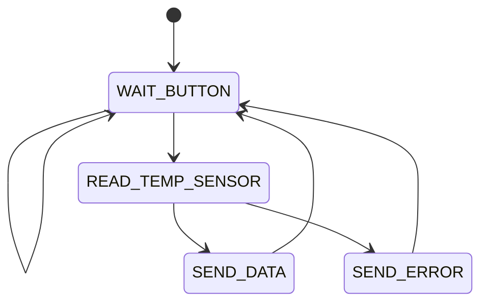

# PdM_ProyectoFinal
## Acerca del proyecto
El proyecto consiste en implementar una MEF que realice la lectura de temperatura de un sensor [DS18B20](https://datasheets.maximintegrated.com/en/ds/DS18B20.pdf) y la envie en una trama por UART.

## MEF
La MEF esta compuesta de 4 estados que se definen a continuacion

#### WAIT_BUTTON
Es el estado inicial de la MEF. Se espera a que el usuario presione el pulsador de la placa NUCLEO-F429ZI.

#### READ_TEMP_SENSOR
Se realiza la conversion y la lectura de temperatura del sensor DS18B20. Si la operacion es exitosa, se procede a enviar los datos por uart. De lo contrario se envia un mensaje de error.

#### SEND_DATA
Se envia la lectura de temperatura con el formato: `>123.45<`

#### SEND_ERROR
Se envia un mensaje de error con el formato: `>SENSOR ERROR<`
